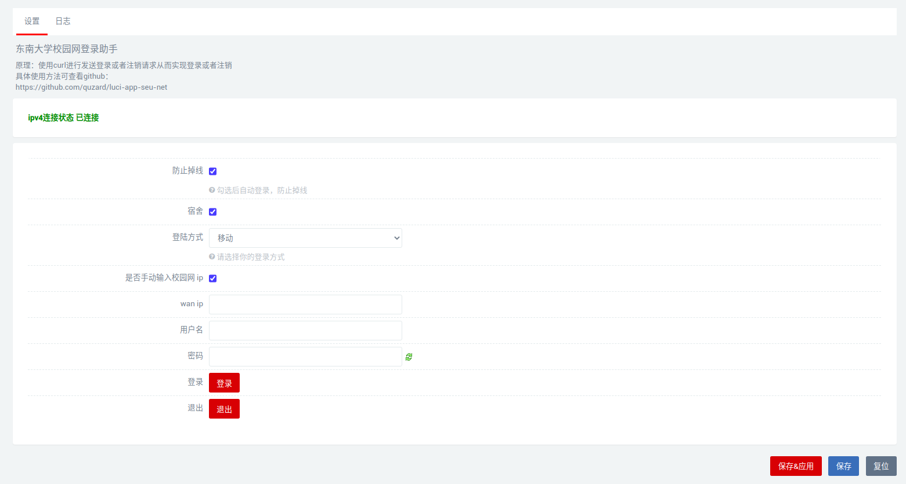

# luci-app-seu-net
- openwrt 东南大学校园网登录助手

  

- 说明

  默认以wan口ip作为登陆ip，如果实际的校园网ip非wan口ip，请选择手动输入校园网ip（如旁路由）

  宿舍区域请选择宿舍，并选择对应的登陆方式

- 编译

    ```bash
    #进入OpenWRT/LEDE源码package目录
    cd package
    #克隆插件源码
    git clone https://github.com/quzard/luci-app-seu-net.git
    #返回上一层目录
    cd ..
    #配置
    make menuconfig
    #在luci->application选中插件luci-app-seu-net,编译
    #单独编译
    make package/luci-app-seu-net/compile V=99
    ```
## Stargazers over time

[](https://starchart.cc/Quzard/luci-app-seu-net)
